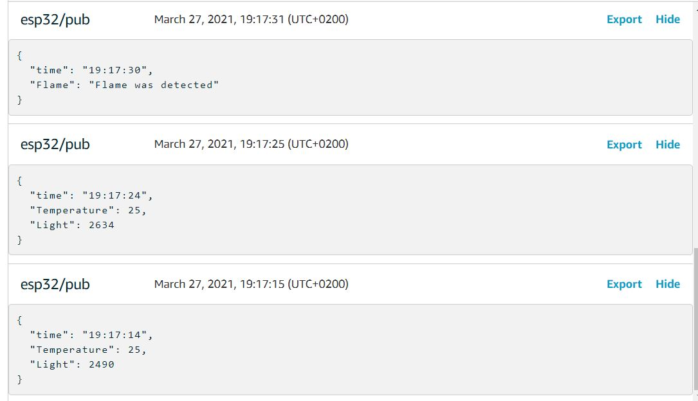
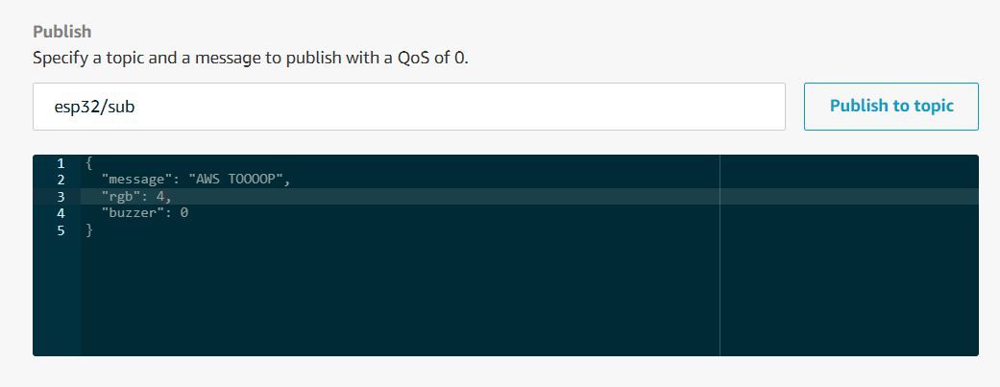

# SmartCampus

### Resources
- **AWS IoT Doc**  
    >> https://docs.aws.amazon.com/iot/latest/developerguide/what-is-aws-iot.html 
- **AWS IoT Core video** 
    >> https://youtu.be/_0us6NzlaoQ

### Elements of device
- **RGB Led**
- **DS18B20 Temperature sensor**
- **2-Pin Flame Detector**
- **Photoresistor**
- **Active Buzzer**

### Something like this
- Subscribing data
 
- Publishing data
 
